# [본 과정] 이커머스 핵심 프로세스 구현
[단기 스킬업 Redis 교육 과정](https://hh-skillup.oopy.io/) 을 통해 상품 조회 및 주문 과정을 구현하며 현업에서 발생하는 문제를 Redis의 핵심 기술을 통해 해결합니다.
> Indexing, Caching을 통한 성능 개선 / 단계별 락 구현을 통한 동시성 이슈 해결 (낙관적/비관적 락, 분산락 등)

---

# 개발환경
>- Spring Boot 3.4.1
>- Java 21
>- Gradle
>- JPA
>- MySQL
>- Docker Compose
>- IntelliJ Http Request

**Clean Code 작성 요구 사항**
>- 가독성 (클래스, 변수, 메서드 이름)
>- 일관된 컨벤션 (불필요한 줄바꿈은 없는지 등) <br> [코딩컨벤션 참고](https://naver.github.io/hackday-conventions-java/#_%EA%B3%B5%EB%B0%B1_whitespace)
>- 스트림, 람다, Optional 을 적절히 사용
>- 중복 코드는 없는지
>- 역할 및 책임 분리가 잘 되어 있는지
  
**참고 사항**
>- 해당 프로젝트에서 PK는 편의상 Auto Increment 를 사용하나, 현업에서는 UUID를 사용하여 PK를 사용하는 추세임.(TimeStamp를 결합하여 순서도 함께 관리)

---

# [1주차] 아키텍처 설계

## 테이블 구조
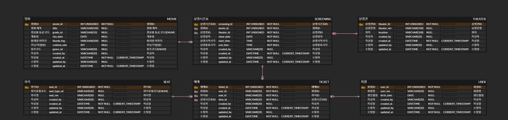
테이블 : 영화, 상영관, 상영시간표, 좌석, 회원, 예매
>- 영화 썸네일 이미지는 URL로만 사용하므로 편의상 파일 테이블을 따로 생성하지 않음.
>- 공통코드는 공통코드 테이블을 생성하지 않고 ENUM으로 관리하며, DB컬럼명을 `_cd` 어미를 붙여 구분하였음 (영상물 등급, 장르, 좌석유형)

---

## 아키텍처(Hexagonal Architecture)
- `cinema-core`
  <br> => *도메인, 엔티티, 비즈니스 로직*
  * 비즈니스 로직의 중심으로, 외부 변화에 의존하지 않도록 설계.
  * 영화, 상영 시간표 등의 도메인 모델과 관련 규칙 정의.
- `cinema-application`
  <br> => *유스케이스(Use Case)*
  * 도메인 로직을 호출하고 조합하여 시스템의 흐름을 관리.
  * 입력(사용자 요청)과 출력(결과 반환)을 조정.
- `cinema-adapter`
  <br> => *(Inbound) REST Controller, CLI*
  * 사용자나 외부 세계의 요청을 애플리케이션에 전달.

  => *(Outbound) JPA Repository, External API*
  * 애플리케이션의 요청을 외부 시스템(DB, API 등)으로 전달.
- `cinema-infra`
  <br> => *DB 연결, 외부 라이브러리 설정*
  * 기술적인 환경과 세부 설정을 처리.
- `cinema-common`
  <br> => *공통으로 사용할 수 있는 유틸리티, 상수, 예외 처리 클래스*
  * 도메인 및 유스케이스와 독립적인 범용 코드를 관리.
  * 비즈니스 로직과 관련 없는 코드만 포함하여 비대화 방지.
> 외부 변화에 대한 의존성을 최소화하기 위하여 Domain 관련한 부분은 `cinema-core` 모듈로 생성하였음.
> `cinema-application`은 전체 시스템의 흐름과 연결을 관리하며 도메인 로직을 호출하고 조합하여 유스케이스(사용 시나리오)를 처리함.
> `cinema-adapter`은 외부 세계와 연결하는 모듈로서 역할을 하며, 입력(Inbound)과 출력(Outbound)으로 나뉨.
> 또한, Port를 구현하여 `cinema-application`이 도메인과 외부 시스템을 매끄럽게 조작할 수 있도록 도움.
> `cinema-infra`는 기술적인 환경을 세팅하는 모듈로 데이터베이스 연결 설정, 외부 라이브러리 설정 등을 함.
> `cinema-common` 모듈은 공통으로 사용할 수 있는 유틸을 묶어두어 범용성 있게 구성하였음. 
> 단, 모듈이 비대해지고 강결합이 발생하지 않도록 변화가 적으며 비즈니스 로직과 관련 없는 코드만 사용하도록 명확히 하여야 함.

---

## ~~해결할 문제 1~~ - 해결 완료
**(문제)** 애플리케이션 실행 시 다음과 같은 오류 발생하여 정상적으로 실행되지 않음.
```dockerfile
***************************
APPLICATION FAILED TO START
***************************

Description:

Failed to configure a DataSource: 'url' attribute is not specified and no embedded datasource could be configured.

Reason: Failed to determine a suitable driver class


Action:

Consider the following:
        If you want an embedded database (H2, HSQL or Derby), please put it on the classpath.
        If you have database settings to be loaded from a particular profile you may need to activate it (no profiles are currently active).
```
-> compose.yaml, application.yml 파일을 수정해보았으나 해결하지 못하였음. `Docker compose` 실행은 정상적으로 되는 상태이나 app url 연결에 문제가 발생하는 것으로 보임.

**(해결 완료)** Docker 포트 변경하여 해결함. 기존 3306 포트 3307로 변경하여 docker compose up 하여 띄운 후 CinemaApplication 실행하니 정상적으로 실행됨.

---

## [1주차] 피드백 후 수정사항
<span style="color: #2D3748; background-color: #fff5b1"><strong>기존테이블</strong></span>
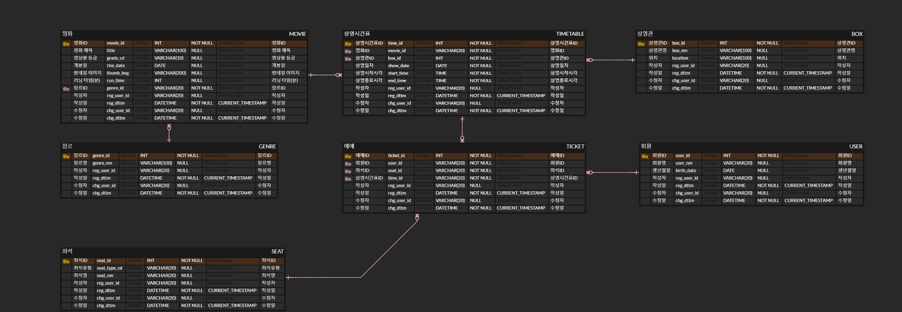

<span style="color: #2D3748; background-color: #fff5b1"><strong>피드백 후 수정테이블</strong></span>

1. ✅ 테이블생성옵션 : `utf8mb4_0900_ai_ci`

   ⇒ 테이블생성옵션으로 추가 완료
2. ✅ INT → UNSIGNED INT 변경

   > 음수를 사용하지 않고 더 많은 데이터 활용 가능
   >

   ⇒ 기존 INT → `INT UNSIGNED`로 변경 완료

3. ✅ 러닝타임이 분단위인지 명확하게 알 수 있도록 컬럼명 수정

   ⇒ 기존 run_time → `runtime_min` 으로 변경 완료

4. ✅ ENUM

   > 장르도 굳이 테이블로 만들지 않고 ENUM으로 바꾸면 좋지 않을까?
   Converter를 사용해서 데이터베이스에 'ACTION'이면 -> 'A' 이렇게 저장해서 데이터베이스 리소스를 절약하는 방법 참고
   >

   ⇒ 장르 테이블 삭제 후 ENUM으로 관리될 항목은 DB컬럼명을 `_cd` 로 어미를 작성하였고, 해당 컬럼의 comment에 [ENUM]이라고 명시하였음.
5. ✅ `LocalDateTime` 네이밍 ~At으로 적용

    ⇒ 기존 reg_dttm, chg_dttm 같이 datetime의 축약어로 dttm으로 사용하던 부분을 좀 더 직관적으로 이해할 수 있도록 created_at, updated_at 으로 변경하였음. 작성자, 수정자도 비슷하게 created_by, updated_by 로 수정 완료

6. ✅ `/api/v1` 패턴, URL 자원을 명사로 표기하는 방으로 API 설계

   > 예약 가능 여부는 query parameter로 구분: /api/movies?bookable=true
   >
   >
   > 이런 식으로 표기하는 것이 좀 더 좋지 않을까? 싶습니다. 이후 확장성 측면에서도 유리할 것 같아 보입니다.

7. ✅ `RequiredArgsConstructor`와 같은 적절한 어노테이션 사용으로 보일러 플레이트 코드 제거
8. ✅ 실무에서는 FK 참조 무결성으로 인한 성능, 스키마 변경, 데이터 이관 및 데이터 클렌징에 대한 편의성 때문에 FK 를 걸지 않는 경우가 많음.
9. ✅ `@CreatedDate`, `@LastModifiedDate` 어노테이션 사용 시 Spring Data JPA Auditing 기능을 활성화하면 자동으로 저장, 수정 시간 설정함.

---

## 해결할 문제 2
**(문제)** 엔티티와 테이블 간 자동 매핑이 되지 않음. 
`application.yml` 파일에 아래와 같이 설정을 하였으나, 스네이크케이스와 카멜케이스 간 자동 변환이 되지 않아 발생하는 문제로 보임.
임시로 `@Table`, `@Column(name="")`을 사용하여 매핑되게 설정하였음. 나중에 여유가 된다면 해결해볼 예정.
```dockerfile
spring:  
  jpa:
    hibernate:
      naming:
        physical-strategy: org.hibernate.boot.model.naming.PhysicalNamingStrategyStandardImpl
        implicit-strategy: org.hibernate.boot.model.naming.ImplicitNamingStrategyJpaCompliantImpl
```

## ~~해결할 문제 3~~ - 해결 완료
**(문제)** Querydsl 의존성 추가 시 Q클래스 생성되지 않는 문제 발생하여
IntelliJ 의 `Build Complier > Annotation Processors` 설정 변경하니,
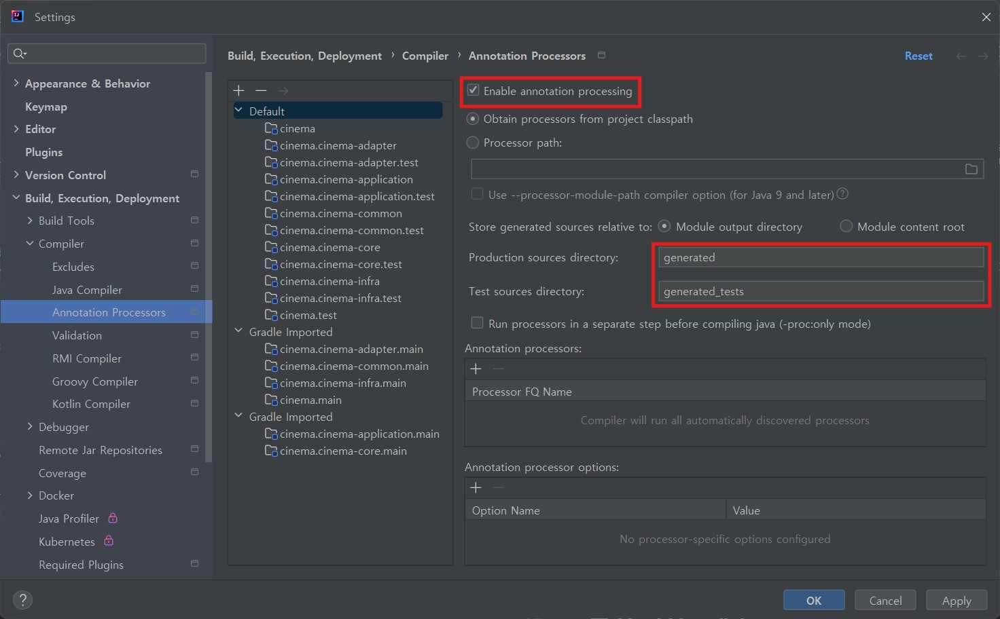

`build/generated/sources/annotationProcessor/java/main` 폴더는 정상적으로 생성되었음.
해당 폴더가 generated sources root로 marked된 것까지 확인되었으나 Q클래스가 생성되지 않음.

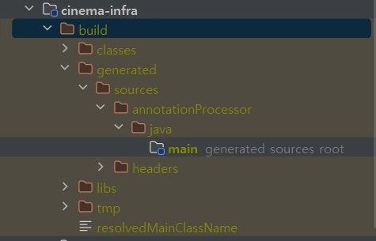

build.gradle 파일을 수정하여 다양한 방법으로 시도하였으나 이틀 동안 해결하지 못하여 일단 Querydsl을 사용하지 않고 진행하기로 함. 나중에 해결해볼 것.

멀티 모듈을 사용함에 따른 모듈 간 의존성 설정 문제일수도 있을 것 같음.

**(해결 완료)**
1. intelliJ 설정 변경 : Settings > Build > Complier > Annotation Processors
2. gradle.build 파일 수정 - 컴파일 시 Annotation Processor가 동작하도록 설정

   ```dockerfile
    tasks.withType(JavaCompile) {
        options.annotationProcessorPath = configurations["annotationProcessor"] // 컴파일 시 Annotation Processor가 동작하도록 설정
    }
    ```
3. gradle.build 파일 수정 - 의존성 추가
   ```dockerfile
    dependencies {
        // QueryDSL 관련 의존성 (Spring Boot 3.x 이상 호환)
        implementation 'com.querydsl:querydsl-jpa:5.0.0:jakarta'              // QueryDSL JPA 의존성
        implementation 'jakarta.persistence:jakarta.persistence-api:3.1.0'
        annotationProcessor "com.querydsl:querydsl-apt:5.0.0:jakarta"         // QueryDSL APT(Annotation Processor) 의존성
        annotationProcessor "jakarta.annotation:jakarta.annotation-api"       // Jakarta Annotation API
        annotationProcessor "jakarta.persistence:jakarta.persistence-api"     // Jakarta Persistence API
   }
    ```
4. Q클래스 생성 확인
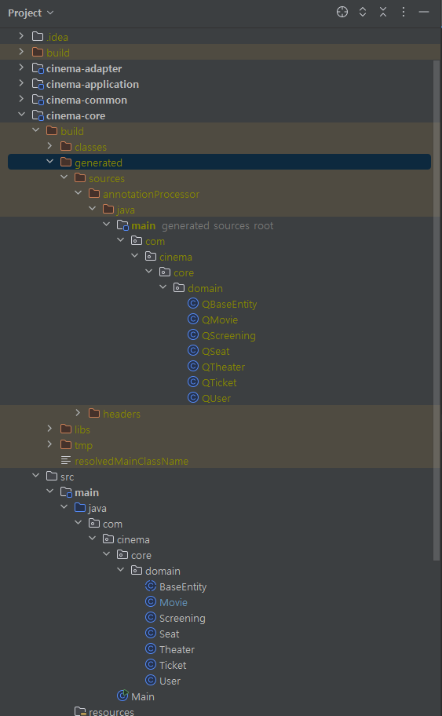
---

# [2주차] 성능 테스트

## 검색 조건 추가
- 제목, 장르 필터

## 인덱스 추가
- 영화 : (조인) 영화 ID / (정렬) 개봉일 / (검색) 제목+장르
- 상영시간표 : (조인) 상영시간표 ID, 영화 ID, 상영관 ID / (정렬) 시작시각
- 상영관 : (조인) 상영시간표 ID
- 좌석 : (조인) 좌석 ID
- 예매 : (조인) 예매 ID, 좌석 ID, 회원 ID, 상영시간표 ID
- 회원 : (조인) 회원 ID

```sql
/* movie */
-- 영화 ID (조인 키)
CREATE INDEX idx_movie_movie_id ON movie (movie_id);
-- 제목 + 장르 복합 인덱스
CREATE INDEX idx_movie_title_genre ON movie (title, genre_cd);
-- 개봉일 인덱스 (정렬 조건)
CREATE INDEX idx_movie_rlse_date ON movie (rlse_date);

/* screening */
-- 상영시간표 ID (조인 키)
CREATE INDEX idx_screening_screening_id ON screening (screening_id);
-- 영화 ID (조인 키)
CREATE INDEX idx_screening_movie_id ON screening (movie_id);
-- 상영관 ID (조인 키)
CREATE INDEX idx_screening_theater_id ON screening (theater_id);
-- 시작 시각 인덱스 (정렬 조건)
CREATE INDEX idx_screening_start_time ON screening (start_time);

/* theater */
-- 상영관 ID (조인 키)
CREATE INDEX idx_theater_theater_id ON theater (theater_id);

/* seat */
-- 좌석 ID (조인 키)
CREATE INDEX idx_seat_seat_id ON seat (seat_id);

/* ticket */
-- 예매 ID (조인 키)
CREATE INDEX idx_ticket_ticket_id ON ticket (ticket_id);
-- 좌석 ID (조인 키)
CREATE INDEX idx_ticket_seat_id ON ticket (seat_id);
-- 회원 ID (조인 키)
CREATE INDEX idx_ticket_user_id ON ticket (user_id);
-- 상영시간표 ID (조인 키)
CREATE INDEX idx_ticket_screening_id ON ticket (screening_id);

/* user */
-- 회원 ID (조인 키)
CREATE INDEX idx_user_user_id ON `user` (user_id);
```

## 성능 테스트 (k6)
### 쿼리 (실제로 동작하는 쿼리)
```sql
select
    distinct m1_0.movie_id,
    m1_0.title,
    m1_0.grade_cd,
    m1_0.rlse_date,
    m1_0.thumb_img,
    m1_0.runtime_min,
    m1_0.genre_cd,
    null 
from
    movie m1_0 
where
    (
        ? is null 
        or m1_0.title like replace(?, '\\', '\\\\')
    ) 
    and (
        ? is null 
        or m1_0.genre_cd=?
    ) 
order by
    m1_0.rlse_date;
    
select
    s1_0.screening_id,
    t1_0.theater_nm,
    s1_0.start_time,
    s1_0.end_time 
from
    screening s1_0 
join
    theater t1_0 
        on s1_0.theater_id=t1_0.theater_id 
where
    s1_0.movie_id=? 
order by
    s1_0.start_time;
```
### 실행 계획 조회 쿼리
```sql
EXPLAIN ANALYZE
 select
        distinct m1_0.movie_id,
        m1_0.title,
        m1_0.grade_cd,
        m1_0.rlse_date,
        m1_0.thumb_img,
        m1_0.runtime_min,
        m1_0.genre_cd,
        null 
    from
        movie m1_0 
    where
        (
            'Red Heat' is null 
            or m1_0.title like replace('Red Heat', '\\', '\\\\')
        ) 
        and (
            'ACTION' is null 
            or m1_0.genre_cd='ACTION'
        ) 
    order by
        m1_0.rlse_date;
        
EXPLAIN ANALYZE
 select
        s1_0.screening_id,
        t1_0.theater_nm,
        s1_0.start_time,
        s1_0.end_time 
    from
        screening s1_0 
    join
        theater t1_0 
            on s1_0.theater_id=t1_0.theater_id 
    where
        s1_0.movie_id=1
    order by
        s1_0.start_time;
```


### *인덱스 X, 캐싱 X*
#### 실행 계획
- like 비교연산자 적용
    ```bash
    -> Sort: m1_0.rlse_date  (cost=51.8 rows=500) (actual time=1.57..1.57 rows=1 loops=1)
        -> Filter: ((m1_0.title like <cache>(convert(replace('Red Heat','\\','\\\\') using utf8mb4))) and (m1_0.genre_cd = 'ACTION'))  (cost=51.8 rows=500) (actual time=0.606..1.54 rows=1 loops=1)
            -> Table scan on m1_0  (cost=51.8 rows=500) (actual time=0.399..1.33 rows=500 loops=1)
    ```
- 동등연산자 적용
    ```dockerfile
    -> Sort: m1_0.rlse_date  (cost=51.8 rows=500) (actual time=0.995..0.995 rows=1 loops=1)
        -> Filter: ((m1_0.title = 'Red Heat') and (m1_0.genre_cd = 'ACTION'))  (cost=51.8 rows=500) (actual time=0.232..0.909 rows=1 loops=1)
            -> Table scan on m1_0  (cost=51.8 rows=500) (actual time=0.102..0.78 rows=500 loops=1)
    ```
- 상영시간표 조회 쿼리
    ```bash
    -> Sort: s1_0.start_time  (actual time=4.31..4.31 rows=9 loops=1)
        -> Stream results  (cost=413 rows=2.13) (actual time=0.43..4.19 rows=9 loops=1)
            -> Inner hash join (s1_0.theater_id = t1_0.theater_id)  (cost=413 rows=2.13) (actual time=0.422..4.15 rows=9 loops=1)
                -> Filter: (s1_0.movie_id = 1)  (cost=79.1 rows=42.6) (actual time=0.326..4.02 rows=9 loops=1)
                    -> Table scan on s1_0  (cost=79.1 rows=4262) (actual time=0.324..3.41 rows=4500 loops=1)
                -> Hash
                    -> Table scan on t1_0  (cost=0.75 rows=5) (actual time=0.0423..0.0495 rows=5 loops=1)
    ```
#### 부하 테스트 결과 (스크린샷)
> thresholds on metrics 'http_req_duration' have been crossed 계속 발생하여 summary.html 파일이 저장되지 않음.


### *인덱스 O, 캐싱 X*
#### 실행 계획

- like 비교연산자 적용
    ```dockerfile
    -> Sort: m1_0.rlse_date  (cost=0.71 rows=1) (actual time=0.419..0.419 rows=1 loops=1)
        -> Index range scan on m1_0 using idx_movie_title_genre over (title = 'Red Heat' AND genre_cd = 'ACTION'), with index condition: ((m1_0.title like <cache>(convert(replace('Red Heat','\\','\\\\') using utf8mb4))) and (m1_0.genre_cd = 'ACTION'))  (cost=0.71 rows=1) (actual time=0.312..0.316 rows=1 loops=1)
    ```
- 동등연산자 적용
    ```dockerfile
    -> Sort: m1_0.rlse_date  (cost=1.1 rows=1) (actual time=0.293..0.293 rows=1 loops=1)
        -> Index lookup on m1_0 using idx_movie_title_genre (title='Red Heat', genre_cd='ACTION')  (cost=1.1 rows=1) (actual time=0.212..0.218 rows=1 loops=1)
    ```
- 상영시간표 조회 쿼리
    ```dockerfile
    -> Sort: s1_0.start_time  (actual time=2.2..2.21 rows=9 loops=1)
        -> Stream results  (cost=8.65 rows=9) (actual time=2.12..2.13 rows=9 loops=1)
            -> Inner hash join (t1_0.theater_id = s1_0.theater_id)  (cost=8.65 rows=9) (actual time=2.1..2.1 rows=9 loops=1)
                -> Table scan on t1_0  (cost=0.122 rows=5) (actual time=2.01..2.01 rows=5 loops=1)
                -> Hash
                    -> Index lookup on s1_0 using idx_screening_movie_id (movie_id=1)  (cost=3.15 rows=9) (actual time=0.0693..0.0716 rows=9 loops=1)
    ```
#### 부하 테스트 결과 (스크린샷)
> thresholds on metrics 'http_req_duration' have been crossed 계속 발생하여 summary.html 파일이 저장되지 않음.


### *인덱스 X, 캐싱 O*
#### 실행 계획
- like 비교연산자 적용
    ```bash
    -> Sort: m1_0.rlse_date  (cost=51.8 rows=500) (actual time=3.79..3.79 rows=1 loops=1)
        -> Filter: ((m1_0.title like <cache>(convert(replace('Red Heat','\\','\\\\') using utf8mb4))) and (m1_0.genre_cd = 'ACTION'))  (cost=51.8 rows=500) (actual time=0.633..1.26 rows=1 loops=1)
            -> Table scan on m1_0  (cost=51.8 rows=500) (actual time=0.42..1.05 rows=500 loops=1)
    ```
- 동등연산자 적용
    ```dockerfile
    -> Sort: m1_0.rlse_date  (cost=51.8 rows=500) (actual time=0.607..0.607 rows=1 loops=1)
        -> Filter: ((m1_0.title = 'Red Heat') and (m1_0.genre_cd = 'ACTION'))  (cost=51.8 rows=500) (actual time=0.128..0.517 rows=1 loops=1)
            -> Table scan on m1_0  (cost=51.8 rows=500) (actual time=0.0718..0.457 rows=500 loops=1)
    ```
- 상영시간표 조회 쿼리
    ```bash
    -> Sort: s1_0.start_time  (actual time=5.63..5.64 rows=9 loops=1)
        -> Stream results  (cost=404 rows=2.08) (actual time=1.3..5.51 rows=9 loops=1)
            -> Inner hash join (s1_0.theater_id = t1_0.theater_id)  (cost=404 rows=2.08) (actual time=1.29..5.47 rows=9 loops=1)
                -> Filter: (s1_0.movie_id = 1)  (cost=77.3 rows=41.7) (actual time=0.59..4.74 rows=9 loops=1)
                    -> Table scan on s1_0  (cost=77.3 rows=4168) (actual time=0.586..4.11 rows=4500 loops=1)
                -> Hash
                    -> Table scan on t1_0  (cost=0.75 rows=5) (actual time=0.602..0.638 rows=5 loops=1)
    ```

#### 부하 테스트 결과 (스크린샷)


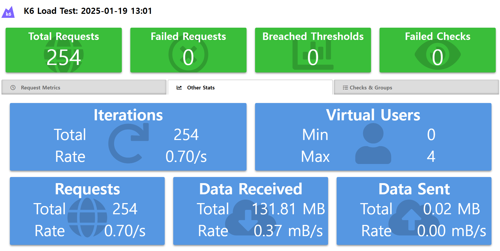


### *인덱스 O, 캐싱 O*
#### 실행 계획
- like 비교연산자 적용
    ```bash
    -> Sort: m1_0.rlse_date  (cost=0.71 rows=1) (actual time=0.332..0.332 rows=1 loops=1)
        -> Index range scan on m1_0 using idx_movie_title_genre over (title = 'Red Heat' AND genre_cd = 'ACTION'), with index condition: ((m1_0.title like <cache>(convert(replace('Red Heat','\\','\\\\') using utf8mb4))) and (m1_0.genre_cd = 'ACTION'))  (cost=0.71 rows=1) (actual time=0.2..0.206 rows=1 loops=1)
    ```
- 동등연산자 적용
    ```dockerfile
    > Sort: m1_0.rlse_date  (cost=0.35 rows=1) (actual time=0.112..0.112 rows=1 loops=1)
        -> Index lookup on m1_0 using idx_movie_title_genre (title='Red Heat', genre_cd='ACTION')  (cost=0.35 rows=1) (actual time=0.0586..0.0612 rows=1 loops=1)
    ```
- 상영시간표 조회 쿼리
    ```bash
    -> Nested loop inner join  (cost=6.3 rows=9) (actual time=0.273..0.283 rows=9 loops=1)
        -> Sort: s1_0.start_time  (cost=3.15 rows=9) (actual time=0.255..0.258 rows=9 loops=1)
            -> Index lookup on s1_0 using idx_screening_movie_id (movie_id=1)  (cost=3.15 rows=9) (actual time=0.209..0.218 rows=9 loops=1)
        -> Single-row index lookup on t1_0 using PRIMARY (theater_id=s1_0.theater_id)  (cost=0.261 rows=1) (actual time=0.00203..0.00207 rows=1 loops=9)
    ```

#### 부하 테스트 결과 (스크린샷)

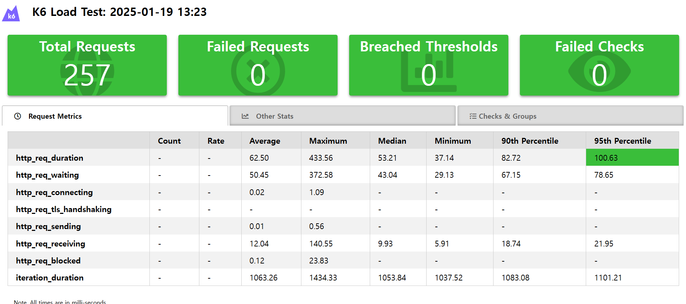
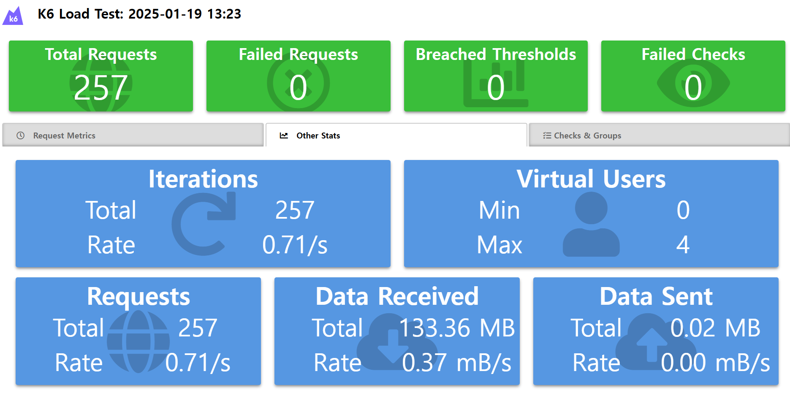


---
## 해결할 문제 4
(문제) API 응답 중 theaterNm 한글 인코딩이 깨져서 나옴.

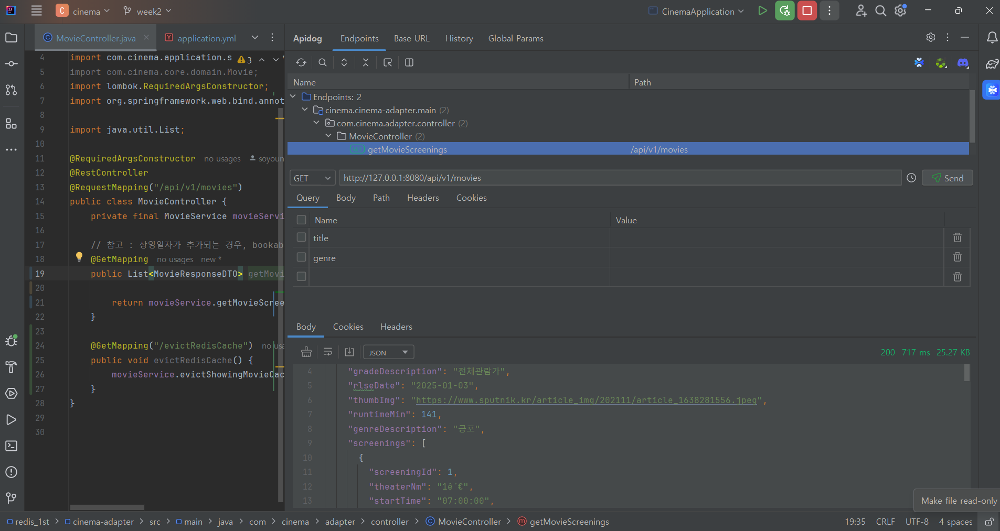

조치1. application.yml 에 http 인코딩 설정 추가

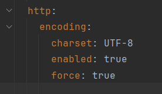

조치2. application.yml jdbc url에 characterEncoding=UTF-8 추가

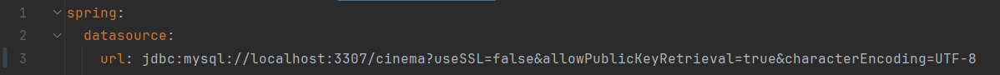

조치3. WebConfig, Utf8EncodingFilter 추가

세 가지 모든 조치 후 DB 데이터 조회 시에는 한글로 정상적으로 조회되나, http 응답시에만 인코딩이 제대로 작동하지 않음.
응답값 Header의 Content-Type 이 application/json;charset=UTF-8 인 것도 확인하였음.

일단 성능테스트 작업이 우선이어서 해결 보류함.

## 해결할 문제 5
(문제) Redis 캐싱 사용하지 않은 상태로 k6 성능테스트 시 
thresholds on metrics 'http_req_duration' have been crossed 발생하여 'p(95)<200' 에서 'p(95)<500' 으로 수정하였음.
실패율 주석처리, duration 시간 늘렸으나 계속 에러 발생 후 결과 파일 저장되지 않음.
```dockerfile
thresholds: {
    http_req_duration: ['p(95)<500'],
}
```


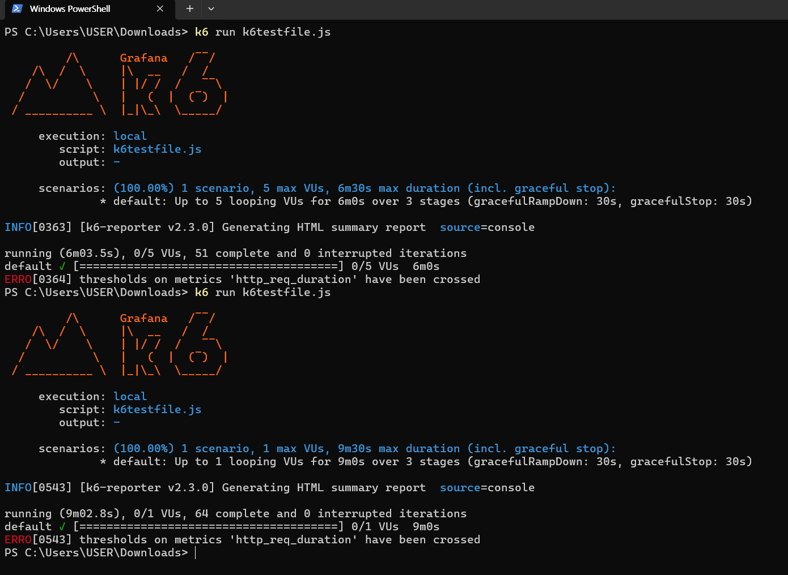


---

## [2주차] 피드백 후 수정사항
<span style="color: #2D3748; background-color: #fff5b1"><strong>기존테이블</strong></span>


<span style="color: #2D3748; background-color: #fff5b1"><strong>피드백 후 수정테이블</strong></span>
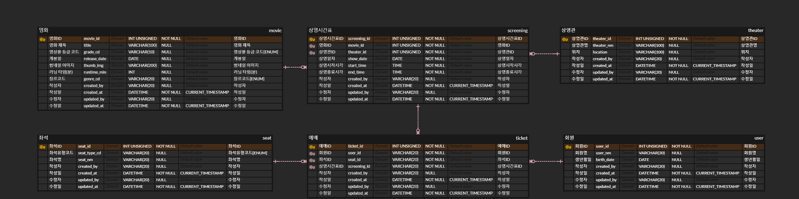

1. ✅ (축약어 지양) movie.rlse_date -> movie.release_date 컬럼명 수정
2. ✅ docker-compose.yml 의 DB에 TimeZone, Collation, Charset 설정하기
3. ✅ Controller에 파라미터 검증 조건 추가 -> `@Valid` 사용
4. ✅ 인덱스 설정 변경 -> join에 사용되는 컬럼이 PK인 경우 굳이 인덱스로 만들어주지 않아도 됨.
    ```sql
    /* movie */
    -- 제목 + 장르 복합 인덱스
    CREATE INDEX idx_movie_title_genre ON movie (title, genre_cd);
    -- 개봉일 인덱스 (정렬 조건)
    CREATE INDEX idx_movie_release_date ON movie (release_date);
    
    /* screening */
    -- 영화 ID (조인 키)
    CREATE INDEX idx_screening_movie_id ON screening (movie_id);
    -- 상영관 ID (조인 키)
    CREATE INDEX idx_screening_theater_id ON screening (theater_id);
    -- 시작 시각 인덱스 (정렬 조건)
    CREATE INDEX idx_screening_start_time ON screening (start_time);
    
    /* ticket */
    -- 좌석 ID (조인 키)
    CREATE INDEX idx_ticket_seat_id ON ticket (seat_id);
    -- 회원 ID (조인 키)
    CREATE INDEX idx_ticket_user_id ON ticket (user_id);
    -- 상영시간표 ID (조인 키)
    CREATE INDEX idx_ticket_screening_id ON ticket (screening_id);
    ```
5. ✅ N+1 문제 해결 -> 기존 Movie 조회, MovieId별 Screening List 조회 두 가지로 나누어서 조회하여 N+1 문제 발생함.
Querydsl로 변경하여 한 번에 조회할 수 있도록 변경함.
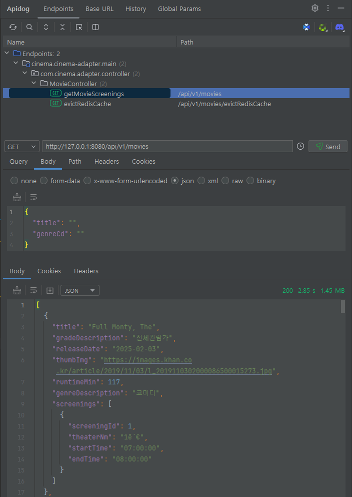


---

# [3주차] 동시성 이슈 해결
## 예매 API 구현
> 하나의 예매당 여러 좌석을 예매할 수 있기 때문에 하나의 예매ID당 좌석ID를 여러 개 매핑해야하는 상황이 생김.
> 1) 예매 테이블의 좌석ID 컬럼에 여러 개의 좌석을 구분자(,)를 넣어 String 형태로 붙여서 관리할지
> 2) 현재는 좌석 테이블에 A1~E5까지의 좌석명 데이터를 넣어서 관리하는데, 좌석명을 enum으로 관리하는게 좋을지
> 3) 예매-좌석 테이블을 추가하여 예매별 좌석정보를 관리할지
> 
> 세 가지 방법 중에 3번과 2번 방법을 복합적으로 사용해야한다고 생각하였음.
> 
> 3번 방법은 <strong>_좌석별 점유 상태 관리_</strong>에 적절할 것이라고 판단하였고,<br> 
> 2번 방법을 적용하면서 <strong>_상영관별 좌석구조_</strong>가 다를 수 있을 경우를 고려하여 
> 좌석 테이블에 상영관 정보를 추가하였음.<br>
> (현재 시나리오 요구사항에는 모든 상영관의 좌석구조가 A1~E5로 동일함.)<br>
> 또한, 1번 방법인 구분자를 넣어서 관리하는 것은 유지보수에 불편함을 초래할 수 있을 것이라 판단하여 사용하지 않았음.

<span style="color: #2D3748; background-color: #fff5b1"><strong>기존테이블</strong></span>


<span style="color: #2D3748; background-color: #fff5b1"><strong>수정테이블</strong></span>
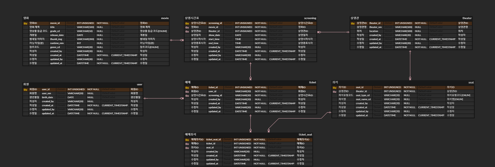

## Lock

> 과제 기간에 설연휴가 겹쳐 할머니댁에 가기 위해 고속버스를 예매해야 했는데, 3주차 시나리오에 나와있는 티머니GO 어플을 사용해보았음.
> SRT앱과 마찬가지로 좌석 선택 후 예매하기를 하면 일정시간 동안 좌석을 점유할 수 있고, 
> 주어진 시간 내에 결제 미완료 시 좌석 점유를 잃는 형태로 되어있음.
> 동시성 제어를 위해 *좌석 점유와 결제 이벤트를 분리*한 것으로 보임.

=> 궁금한 점 : 보통 예매 시스템에서 좌석을 누르는 순간 바로 점유 여부를 체크하는지 아니면 좌석을 누른 후 선택하기 버튼을 추가로 눌렀을 때 점유 여부를 체크하는지?

### Pessimistic Lock (비관적 락)
- 트랜잭션이 시작될 때 해당 행을 잠금 처리하고, 다른 트랜잭션이 해당 데이터를 읽거나 수정하지 못하도록 막는 방식.
- 좌석 예약 가능 여부 조회하는 쿼리에 `@Lock(LockModeType.PESSIMISTIC_WRITE)` 붙여줌.

### Optimistic Lock (낙관적 락)
- 충돌 가능성이 낮을 때 사용하며 충돌 발생 시 재시도가 필요함.
- Entity 클래스에 `@Version` 붙여줌. 예매 테이블 version 컬럼 생성

### Distributed Lock (분산 락)
- Redisson을 통해 락을 획득하고 해제하는 동안, 다른 서버 인스턴스에서 동일한 리소스를 수정하지 못하도록 보장
- lock.tryLock(waitTime, leaseTime, timeUnit)
  - waitTime : 락 대기 시간
  - leaseTime : 락 유지 시간
  - timeUnit : 시간 단위
  > 시간상 성능테스트를 정확히 해보지는 못했지만, 
  > API 테스트툴로 예매 API 호출 시 1초가 채 되지 않는 100ms 전후로 응답이 처리되고 있음.
  > leaseTime 을 너무 짧게 주는 경우는 서버에서 정상적으로 처리되기 이전에 락이 풀려버릴 수 있기 때문에 3초 정도로 여유를 주었음.
  > waitTime 을 5초로 설정한 것은 사용자가 너무 길게 느껴지지 않는 시간이면서 서버 처리시간에 여유를 주었고, 
  > leaseTime 보다 살짝 길게 설정하여 데이터 정합성이 유지될 수 있도록 하였음.


